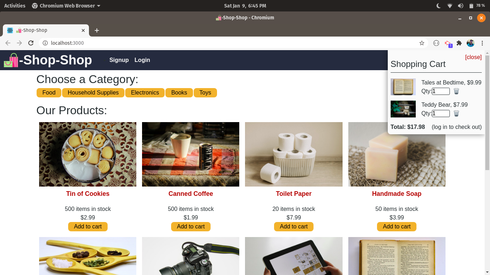

# Shop Shop

## Description

[Deployed Application - https://warm-inlet-69729.herokuapp.com](https://warm-inlet-69729.herokuapp.com/)

Shop-Shop is a MERN stack web app that utilizes Redux for keeping track of a global state. The web app allows you to:

- Filter items by category
- Add or remove items to a globally accessible cart
- User database which allows customers to checkout
- Process payments with Stripe

## Table of Contents

- [Installation](#installation)
- [Usage](#usage)
- [Credits](#Credits)
- [Questions](#questions)

## Installation

1. Prerequisite: MongoDB is already installed and configured
2. Clone the repository then run `npm install package.json` to make sure all dependencies are gotten. A custom script will install the dependencies in the client & server directories
3. Run npm start. Concurrently will run both the client and server.

## Usage

Once the server is running, you can connect to localhost:3000 or the deployed application. All data communicates with the backend by using Apollo and GraphQL. Tests can be made at localhost:3001/graphql.

Create an account with the signup form or login if you already have one. You may add items to your cart while not logged in but you will not be able to check out.

Navigate to the items you wish to add to the cart then select add to cart. A globally accessible cart can be accessed in the top right with the cart icon where the cart can be managed. You can then use the Stripe checkout form to process payment.

Replace the Stripe test API key with your own Stripe API key for production otherwise payments will not be received.

## Credits

http://github.com/mondrovic

## Inquiries

Any questions or inquiries can go to mondrovic1@gmail.com
Matthew Ondrovic
https://githbub.com/mondrovic
